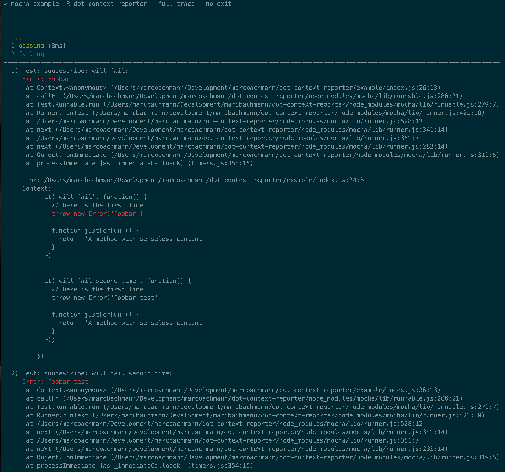

# An extended mocha dot reporter



This reporter only works on node.
To get it to work correctly, you need to
- have grep on your system and have it in your PATH
- Enable full stack traces (to get error highlighting to work, pass --no-exit argument)
- Prevent mocha from using `process.exit` (pass --no-exit argument)

E.g.
```
mocha ./test -R mocha-context-reporter --full-trace --no-exit
```
